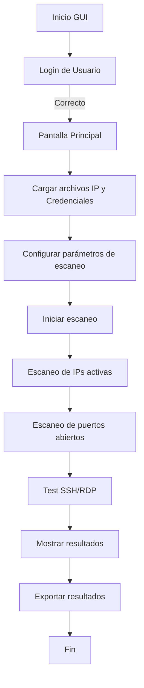

# s4 - Network Scanner Pro

**Network Scanner Pro** es una aplicación de escritorio desarrollada en `Tkinter` que permite:
- Escanear subredes IP automáticamente.
- Detectar puertos abiertos.
- Probar credenciales SSH y RDP en hosts activos.
- Exportar resultados por categoría.

---

## ⚙️ Funcionamiento General

1. **Autenticación Inicial**:
   - Acceso protegido mediante login simple.
   - Interfaz principal desbloqueada tras autenticación exitosa.

2. **Carga de Datos**:
   - Carga listas de IPs y credenciales desde archivos externos (`ip.txt`, `creds.txt`).

3. **Configuración**:
   - Número de hilos.
   - Timeout de escaneo.
   - Puerto RDP.
   - Modo de escaneo (rápido, estándar, completo).

4. **Escaneo**:
   - Búsqueda de IPs activas mediante puertos comunes.
   - Escaneo de puertos conocidos o rango completo (1-65535).
   - Pruebas SSH (vía `asyncssh`) y RDP (vía `xfreerdp`).

5. **Resultados**:
   - Registro visual en tabs separados: IPs, puertos, conexiones SSH/RDP.
   - Estadísticas y progreso visual en tiempo real.
   - Exportación de datos.

---

## 🔄 Flujo del Programa

---

## 🚀 Eficiencia y Rendimiento

- **Paralelismo**: Usa `asyncio` + `threading` para maximizar la concurrencia de tareas.
- **Rendimiento escalable**: Ajuste dinámico del tamaño de lote y tareas pendientes.
- **Batching**: Credenciales se prueban en bloques para minimizar latencia.
- **Configuración guardada**: Persistencia vía `config.cfg` para sesiones futuras.

### Benchmarks estimados (en máquina moderna):
| Modo | IPs analizadas | Tiempo aprox. |
|------|----------------|----------------|
| Rápido | 512 | ~15 seg |
| Estándar | 1024 | ~1 min |
| Completo | 1024 con full scan | ~4-5 min |

---

## 🔐 Seguridad

- Las credenciales se pueden cifrar utilizando `Fernet` (clave generada en `secret.key`).
- Los datos ingresados no se transmiten fuera del entorno local.

